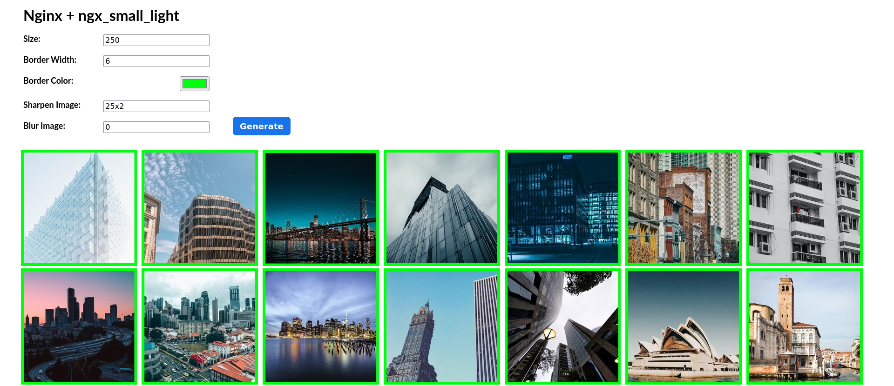
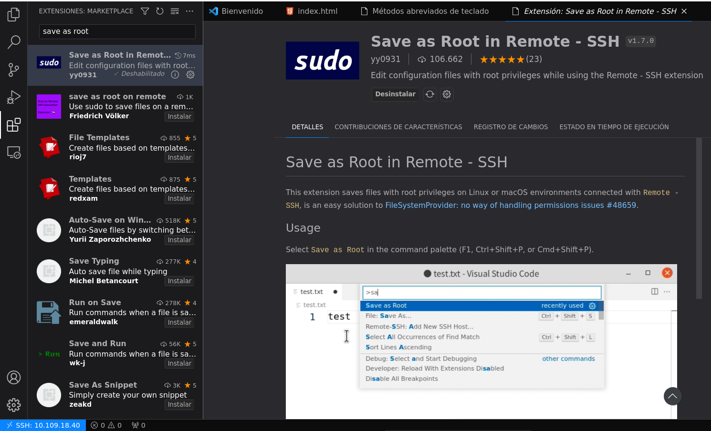

<div align="center">

# Nginx Small Light. Images.

</div>

<div align="right">

#### ***Alejandro Hernández Domínguez***

#### ***2º de Ciclo Superior de Desarrollo de Aplicaciones Web***

</div>

### ÍNDICE

<div align="justify">


+ [Introducción.](#id1)
+ [Objetivos.](#id2)
+ [Material empleado.](#id3)
+ [Aplicación web.](#id4)
+ [Desarrollo.](#id5)
+ [Conclusiones.](#id6)


### Introducción <a name="id1"></a>

1. Implantar una aplicación, "Images" que permita generar miniaturas de imagenes on the fly además de otros posibles procesamientos a través de peticiones URL, usando Nginx + Ngx Small Light.

### Objetivos <a name="id2"></a>

 1. Instalar el módulo ngx_small_light y cargarlo dinámicamente en Nginx.
 2.Crear un virtual host específico que atienda peticiones en el dominio images.nombrealumno.me (server_name).
 2. Habilitar el módulo ngx_small_light en el virtual host sólo para el location /img.
 3. Subir las imágenes de images.zip (el archivo de adjunta a la tarea ) a una carpeta img dentro de la carpeta de trabajo elegida.
 4. Crear una aplicación web que permita el tratamiento de dichas imágenes.
 5. Incorporar certificado de seguridad (mostrar el certificado 🔒).
 6. Redirigir el subdominio www al dominio base (incluyendo ssl).

### Material empleado <a name="id3"></a>

1. Se ha empleado el equipo del aula.
2. Las máquinas virtuales configuradas para el despliegue. 
3. Despliegue nativo haciendo uso de servidor nginx.
4. Despliegue dokerizado, mediante docker compose y dockerfile.
5. Para la instalación del módulo seguir las instrucciones de instalación de módulos, teniendo en cuenta que:

- Se deben instalar las siguientes dependencias:

```
sudo apt install -y build-essential imagemagick libpcre3 libpcre3-dev libmagickwand-dev
```

- Hay que descargar el código fuente del módulo con:

```
git clone https://github.com/cubicdaiya/ngx_small_light.git
```

- Hay que "configurar" el módulo, previo a la configuración de Nginx, entrando en la carpeta del módulo y ejecutando:

```
./setup
```

### Aplicacion Web<a name="id4"></a>

La aplicación debe contener un formulario web con los siguientes campos de texto:

- Tamaño de la imagen → En píxeles (corresponde al "lado": imágenes cuadradas)
- Ancho del borde → En píxeles
- Color del borde → Formato hexadecimal
- Enfoque → Formato <radius>x<sigma>
- Desenfoque → Formato <radius>x<sigma>

Al pulsar el botón de **Generar** se tendrán que mostrar todas las imágenes cambiando la URL del atributo src de cada imagen  para contemplar los parámetros establecidos en el formulario.

<div align="center">



</div>

### Desarrollo<a name="id5"></a>

- Para comenzar la práctica nos conectamos a la máquina servidor a través de ssh y una máquina cliente, habrá que acceder con la contraseña:

```
ssh 10.109.18.40
```

- Instalaremos el modulo **Small Light** siguiendo los siguientes comandos:

```
sudo apt install -y build-essential imagemagick libpcre3 libpcre3-dev libmagickwand-dev
```

```
git clone https://github.com/cubicdaiya/ngx_small_light.git
```

```
./setup
```

- Moveremos el directrio del modulo al directorio **/tmp**:

```
mv ngx_small_light/ /tmp/
```

- Dado que el código fuente de **nginx-1.24** no se encuentra en **/tmp** los descargaremos nuevamente:

```
curl -sL https://nginx.org/download/nginx-$(/sbin/nginx -v \ |& cut -d '/' -f2).tar.gz | tar xvz -C /tmp
```

- Ejecutamos la configuración de la compilación con el siguiente comando, estando en el directorio **/tmp/nginx-1.24.0**:

```
cd /tmp/nginx-1.24.0
```

```
./configure --add-dynamic-module=../ngx_small_light --with-compat
```

- Estando en el mismo directorio y subcarpeta ejecutaremos el siguiente comando para generar la librería dinámica:

```
make modules
```

- A continuación se habrá generado un fichero **.so** dentro del directorio **objs** desde la cual se cargan los módulos dinámicos de **nginx**:

```
sudo cp /tmp/nginx-1.24.0/objs/ngx_http_small_light_module.so .
```

- Para que el módulo se cargue correctamente, hay que especificarlo en el fichero de configuración de **nginx**:

```
pc18-dpl@a109pc18dpl:~$ cat /etc/nginx/nginx.conf 

user  nginx;
worker_processes  auto;

error_log  /var/log/nginx/error.log notice;
pid        /var/run/nginx.pid;

load_module /etc/nginx/modules/ngx_http_fancyindex_module.so;
load_module /etc/nginx/modules/ngx_http_small_light_module.so;

events {
    worker_connections  1024;
}


http {
    include       /etc/nginx/mime.types;
    default_type  application/octet-stream;

    log_format  main  '$remote_addr - $remote_user [$time_local] "$request" '
                      '$status $body_bytes_sent "$http_referer" '
                      '"$http_user_agent" "$http_x_forwarded_for"';

    access_log  /var/log/nginx/access.log  main;

    sendfile        on;
    #tcp_nopush     on;

    keepalive_timeout  65;

    #gzip  on;

    include /etc/nginx/conf.d/*.conf;
}
```

- Finalmente, con respecto a la configuración, añadiremos las directivas del módulo a la configuración del **virtual host** modificando el fichero **images.conf**:

```
sudo nano /etc/nginx/conf.d/images.conf
```

```
pc18-dpl@a109pc18dpl:~$ cat /etc/nginx/conf.d/images.conf 
server {
	
	root /usr/share/nginx/images;
	server_name images.alejandrohernandez.me;
	index index.html;	
	
	location /img {
		small_light on;
		small_light_getparam_mode on;
	}
}
```

- Deberemos recargar el servicio de **nginx**, se recomienda hacer uso también de el siguiente comando para control de errores:

```
sudo systemctl reload nginx
```

```
sudo tail -f /var/log/nginx/error.log
```

- Será necesario crear una estructura de carpetas en la ruta correspondiente, en la que se encuentren: código HTML, estilos CSS, y funcionalidades en JavaScript. Todos ellos en sus directorios respectivamente, como se muestra a continuación:

```
pc18-dpl@a109pc18dpl:/usr/share/nginx/images$ tree
.
├── css
│   └── style.css
├── img
│   ├── image01.jpg
│   ├── image02.jpg
│   ├── image03.jpg
│   ├── image04.jpg
│   ├── image05.jpg
│   ├── image06.jpg
│   ├── image07.jpg
│   ├── image08.jpg
│   ├── image09.jpg
│   ├── image10.jpg
│   ├── image11.jpg
│   ├── image12.jpg
│   ├── image13.jpg
│   ├── image14.jpg
│   ├── image15.jpg
│   ├── image16.jpg
│   ├── image17.jpg
│   ├── image18.jpg
│   ├── image19.jpg
│   └── image20.jpg
├── index.html
└── js
    └── script.js

4 directories, 23 files
```

- Para mayor fluidez en el desarrollo de la práctica se recomienda hacer uso de las extesiones, en este caso para **VS Code** de **Remote - SSH** para conectarnos a través de ssh, usando **VSCode** a la máquina servidor, y a su vez, hacer uso de la extensión **Save as Root in Remote - SSH** para evitar el bloqueo por permisos de copia y creación de directorios y ficheros en la máquina. La **Five - Server** también se considera una extensión de gran utilidad.

<div align="center">



</div>

<div align="center">


</div>

### Dockerizando

- Se ha dockerizado la aplicación haciendo uso de un Dockerfile, el cúal se encarga de descargar la imagen de nginx (1.24.0), instalar en ella las distitnas dependencias necesarias para nuestra aplicación (git, curl, small light, etc), configura el modulo small light de manera dinámica, crea la carpeta correspondiente a dicho modulo y copia el fichero .so en dicha carpeta. Finalmente copia el fichero de configuración de nginx.

```
pc18-dpl@a109pc18dpl:~/dev/app$ ls -l
total 24
-rw-r--r-- 1 root     root      145 nov  2 15:51 default.conf
-rw-r--r-- 1 root     root      236 nov  2 15:51 docker-compose.yml
-rw-r--r-- 1 root     root      680 nov  2 14:58 Dockerfile
drwxr-xr-x 5 root     root     4096 oct 30 17:06 images
-rw-r--r-- 1 root     root      711 nov  2 15:05 nginx.conf
drwxr-xr-x 2 pc18-dpl pc18-dpl 4096 oct  5 15:26 src
```

```
pc18-dpl@a109pc18dpl:~/dev/app$ cat Dockerfile
FROM nginx:1.24.0
RUN apt update 
RUN apt install -y gcc make pkg-config libmagickwand-dev libpcre3-dev git curl tar gzip gnupg2 ca-certificates zlib1g zlib1g-dev libssl-dev lsb-release debian-archive-keyring > /dev/null 2>&1
RUN curl -sL https://nginx.org/download/nginx-1.24.0.tar.gz | tar xvz -C /tmp
RUN git clone https://github.com/cubicdaiya/ngx_small_light.git /tmp/ngx_small_light
WORKDIR "/tmp/ngx_small_light"
RUN ./setup
WORKDIR "/tmp/nginx-1.24.0"
RUN ./configure --add-dynamic-module=../ngx_small_light --with-compat
RUN make modules
RUN mkdir -p /etc/nginx/modules
RUN cp objs/ngx_http_small_light_module.so /etc/nginx/modules
COPY nginx.conf /etc/nginx/nginx.conf
```

- Después de crear el "Dockerfile" editamos el "docker-compose.yml" con las siguientes líneas. Este fichero se encargrá de montar el docker y referenciar los volumenes de nuestra aplicación nativa (images) y el defatult.conf con las rutas correspondientes al docker. Establecemos el puerto 90 como puerto de despliegue de nuestra aplicación dockerizada.
```
pc18-dpl@a109pc18dpl:~/dev/app$ cat docker-compose.yml 
version: "3.3"

services:
  web:
    build: .
    container_name: alejandronginx
    volumes:
      - ./images:/etc/nginx/html # "root" por defecto en Nginx
      - ./default.conf:/etc/nginx/conf.d/default.conf
    ports:
      - 90:80
```

- Finalmente ejecutamos el comando "docker compose up", que en primer lugar procederá a ejecutar el "Dockerfile" y todas las instrucciones establecidas en él (descarga de imagen nginx, dependencias, configurar modulo, etc) una vez finalice y si todo ha ido bien, tendremos levantada nuestra aplicación con el name server correspondiente y en el puerto correspondiente.

### Conclusiones<a name="id6"></a>

- En términos generales la práctica ha servido para conocer distintos módulos con utilidades que nos puedan llegar a interesar en el desarrollo de determinadas aplicaciones web futuras. Por último destacar el aprendizaje de dockerizar una aplicación de manera rápida y efectiva haciendo uso de  un "Dockerfile".

</div>